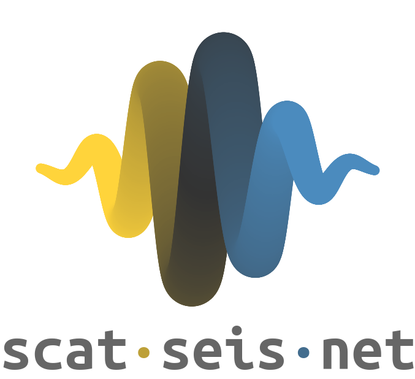

Welcome to **scatseisnet**'s documentation!
===========================================

.. raw:: html

   

      
   

|

The **scatseisnet** library contains programs to transform time series into scattering
coefficients with a scattering network. The scattering network is a deep
neural network with wavelet filters as convolutional layers. The code repository is hosted on github at: https://github.com/scatseisnet/scatseisnet

About
-----

This package was written and documented by Léonard Seydoux and René Steinmann.
The core of the package and docstrings was written by Léonard Seydoux, the
documentation was generated using ReadTheDocs and the tutorials were written
by René Steinmann and Léonard Seydoux. The notebooks are a simplified product of the papers published by René Steinmann.

This work was supported by the European Advanced Grant *F-IMAGE* (ERC PE10,
ERC-2016-ADG) and by the Multidisciplinary Institute of Artificial Intelligence
(MIAI) at the University of Grenoble Alpes.

The **scatseisnet** package is under construction. A target release date will be
around April 2023.

License
-------

**Copyright ©️ 2023 Léonard Seydoux and René Steinmann**

This program is free software: you can redistribute it and/or modify
it under the terms of the GNU General Public License as published by
the Free Software Foundation, either version 3 of the License, or
(at your option) any later version. This program is distributed in the hope that it will be useful, but WITHOUT ANY WARRANTY; without even the implied warranty of
MERCHANTABILITY or FITNESS FOR A PARTICULAR PURPOSE.  See the
GNU General Public License for more details.

You should have received a copy of the GNU General Public License
along with this program. If not, see https://www.gnu.org/licenses.

Installation
------------

We are planning to release the package on pypi, for now you can install the
package with the following command. Please consider installing the package at a
location where you have write access, and which should not change over time.
You may also want to run the command in a virtual environment (e.g. conda) for a
clean installation.

.. code-block:: bash
   :caption: CPU-only installation

   git clone https://github.com/scatseisnet/scatseisnet.git 
   cd scatseisnet
   pip install -e .

If you want to use a GPU, you need to install the package with the package CuPy.
The code will try to find it and use it if it is installed. You can install it
with the following command.

.. code-block:: bash
   :caption: GPU usage

   pip install cupy

.. important::

   This project is still in development. The API is not stable and may change
   without notice. Once a stable version is released, the API will be
   considered stable and will not change without a major version bump.

Purpose and philosophy of this Package
--------------------------------------

In the recent years, we worked on a scattering network for seismic time series data, mainly for data exploration task involving dimensionality reduction and clustering.
We've seen an increasing interest in the seismological community for this kind of approach, and decided to make the code available to the community. 
This package delivers the network instance and in the tutorials we introduce the scattering network together with some data exploration applications.
Please note that the task and data at hand drive the choice of the exact design of the scattering network and the tools used for data exploration.
The following papers show some possible applications and we hope that they can inspire you for your specific use case. 
If you use this package for your own scientific output, please cite one or more
of the following papers.

Contents
--------

.. toctree::
   :maxdepth: 2

   notebooks

References
----------

1. Seydoux, L., Balestriero, R., Poli, P. et al. *Clustering earthquake signals and background noises in continuous seismic data with unsupervised deep learning.* Nat Commun 11, 3972 (2020). https://doi.org/10.1038/s41467-020-17841-x

2. Barkaoui, S., Lognonné, P., Kawamura, T., Stutzmann, É., Seydoux, L., de Hoop, M. V., ... & Banerdt, W. B. (2021). *Anatomy of continuous Mars SEIS and pressure data from unsupervised learning.* Bulletin of the Seismological Society of America, 111(6), 2964-2981. https://doi.org/10.1785/0120210095

3. Steinmann, R., Seydoux, L., Beaucé, E., & Campillo, M. (2022). *Hierarchical exploration of continuous seismograms with unsupervised learning.* Journal of Geophysical Research: Solid Earth, 127(1), e2021JB022455. https://doi.org/10.1029/2021JB022455

4. Steinmann, R., Seydoux, L., & Campillo, M. (2022). *AI-Based Unmixing of Medium and Source Signatures From Seismograms: Ground Freezing Patterns* Geophysical Research Letters, 49(15), e2022GL098854. https://doi.org/10.1029/2022GL098854